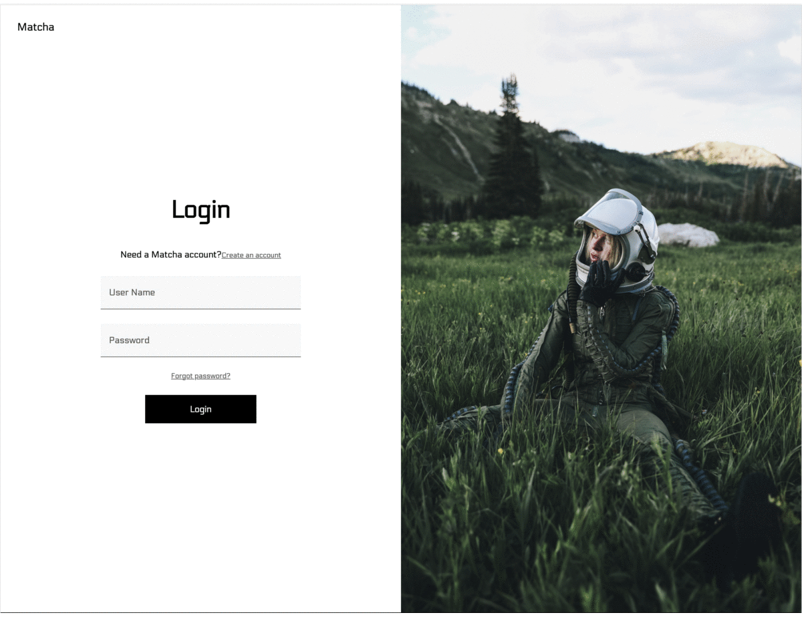

# Matcha Project

##  Introduction

Matcha is a dating web app, 
This application was made for the sole purpose of learning how to develop a web application without using :

<p align="center">
	<a href="https://reactjs.org"></a>
    <a href=""></a>
    <a href=""></a>
    <a href=""></a>
	<a href="https://reactjs.org"></a>
</p>

<hr />


<!-- ```
Create your one or test with:
````
### Account for the test
| userName        | Password    |
| --------------- | ----------- |
| Adam            | Test@123456 |
| aurora          | Test@123456 |

## ⚠ Warnings
The hosting service Heroku may have a certain delay (~ 1 min) for uploading the application so the loading of the website may have a certain delay.  -->
## Gallery



```
Like we said, Matcha is a dating web app.
Now we will look at Matcha's features in more detail.
help to Find matches: Users can set interests, age, gender, etc. as search criteria. 
Then, the app makes a match between users who like each other's profiles.

## Profile setting.
Matcha users can set their profiles to make them more trustworthy and attractive.
push notification. 
When the application's algorithm finds a suitable match, the user receives an instant notification.
private chat. 
When the app performs a match, users can chat in the built-in unscripted messenger.
```

<!--
In the project directory, you can run:
### `npm start`

Runs the app in the development mode.\
Open [http://localhost:3000](http://localhost:3000) to view it in your browser.
 -->
